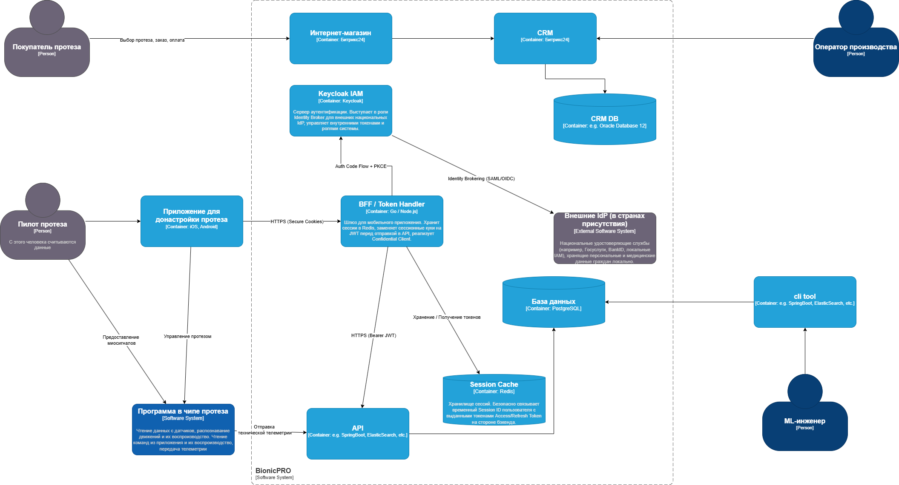

Для решения проблем безопасности BionicPRO, защиты от повторных взломов и подготовки системы к международной экспансии с соблюдением требований локализации данных, стандартного протокола _OAuth 2.0 Authorization Code Flow_ на стороне мобильного приложения недостаточно.

Поскольку мобильное приложение (iOS/Android) является **публичным клиентом (Public Client)**, оно не может безопасно хранить `client_secret`, а хранение JWT-токенов (`access` и `refresh`) в локальном хранилище устройства (Shared Preferences / Keychain) подвержено рискам утечки при компрометации ОС устройства.

Ниже представлено детальное архитектурное решение и инструкции по изменению вашей диаграммы C4.

## Архитектурное решение: Паттерн BFF + Token Handler & Identity Broker

Для выполнения всех условий задачи мы внедряем два фундаментальных архитектурных паттерна:

1.  **Token Handler / BFF (Backend for Frontend) Pattern:** Фронтенд полностью изолируется от JWT-токенов. Авторизационные токены хранятся исключительно на защищенном бэкенде.
    
2.  **Identity Brokering (в Keycloak):** Keycloak выступает в роли единого федеративного шлюза, делегирующего саму аутентификацию внешним национальным сервисам в странах присутствия.
    

### Как это решает бизнес-задачи:

-   **Безопасность токенов:** Мобильное приложение общается с бэкендом через безопасные сессионные куки (`HttpOnly`, `Secure`, `SameSite`). Реальные `access_token` и `refresh_token` оседают в защищенном кэше на бэкенде. Их перехват с устройства становится невозможным.
    
-   **Локализация и комплаенс:** Медицинские и персональные учетные данные физически остаются во внешних источниках конкретной страны. BionicPRO не импортирует их в единую глобальную базу данных, а лишь доверяет подписанным криптографическим утверждениям (Assertions) от локальных IdP.
    
-   **Масштабируемость на новые рынки:** Подключение новой страны не требует изменения кода приложений. В Keycloak просто добавляется новый провайдер (Identity Provider) через стандартные протоколы (SAML 2.0 / OIDC).

## Пошаговый сценарий работы новой архитектуры

> **Сценарий авторизации:**
> 
> 1.  Пользователь в **Мобильном приложении** нажимает «Войти». Приложение открывает защищенную системную вкладку браузера (Webview) на эндпоинт **BFF / Token Handler**.
>     
> 2.  **BFF** генерирует параметры `code_verifier`/`code_challenge` (PKCE) и перенаправляет пользователя на **Keycloak IAM**.
>     
> 3.  **Keycloak** определяет геолокацию/выбор пользователя и делегирует запрос на авторизацию во **Внешнюю удостоверяющую службу** нужной страны.
>     
> 4.  Пользователь вводит данные на государственном/локальном портале. Локальный портал возвращает в **Keycloak** подписанный криптографический ответ.
>     
> 5.  **Keycloak** на основе этого ответа выпускает внутренние JWT BionicPRO и отдает временный `Authorization Code` обратно в **BFF**.
>     
> 6.  **BFF** по защищенному каналу меняет этот код у **Keycloak** на `access_token` и `refresh_token`.
>     
> 7.  **BFF** сохраняет эти токены в **Redis**, а мобильному приложению возвращает куку с `Session ID`.
>     
> 8.  При дальнейших запросах к **API** (например, за получением отчетов), приложение присылает куку, **BFF** подменяет её на реальный `access_token` из Redis и выполняет запрос к **API**.
>

## Визуализация контекста (C4)

[Ссылка на исходный код UML](BionicPRO_C4_model.drawio.xml)
